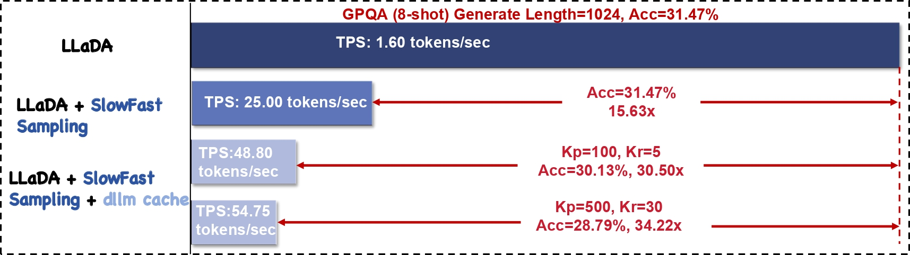
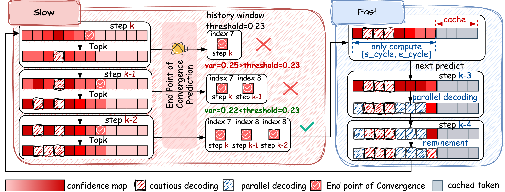

# Accelerating Diffusion Large Language Models with SlowFast Sampling: The Three Golden Principles
Official PyTorch implementation of the paper "[Accelerating Diffusion Large Language Models with SlowFast Sampling: The Three Golden Principles](docs/SlowFastSampling.pdf)" (**Slow Fast Sampling**).  

***The Three Golden Principles: Certainty · Convergence · Positional***

<!-- [](LICENSE)
[](#installation)
[](https://arxiv.org/abs/2406.12345) -->

<div align="center">

  
**Fig. 1 – Throughput and Accuracy Comparison on GPQA (8-shot, Length=1024) with LLaDA and Our Proposed Methods.**

</div>

<!-- --- -->

<!-- ## 🔥 News -->
<!-- | Date | Update |
|------|--------|
| **2025-06-12** | **SFS** is now the default sampler in **LLaDA-V** |
| 2025-06-01 | Open-sourced the full PyTorch implementation & reproducible scripts |
| 2025-05-30 | Pre-print released on arXiv | -->

---

## ✨ Key Highlights
| 💗💗💗 | What makes Slow Fast Sampling special? |
|----|-------------------------|
| **Three Golden Principles** 👑 |***Certainty*, *Convergence*, *Positional*** guide exactly *when* and *where* to decode. |
| **Two-Stage Dance** 🐢→⚡ | Cautious ***Slow*** phase finds a stable span, then the ***Fast*** phase parallel-decodes it in one swoop. |
| **Plug-and-Play** 🔌 | Drop-in sampler for any *masked-diffusion LLM*: LLaDA-8B, Dream-7B. |
| **Crazy Speed-ups** ⚡ | **15.6 ×** faster than vanilla diffusion; **34.2 ×** with [`dLLM-Cache`](https://github.com/maomaocun/dLLM-Cache) —with *minimal* accuracy loss.  |
| **Outruns ARMs** 🏃 | Beats LLaMA-3 8B in throughput while matching accuracy (Table 4, p. 9). |

---

## 🚀 Pipeline at a Glance
<div align="center">

  
**Fig. 2 – Overview of the Slow Fast Sampling Pipeline: From Exploratory to Accelerated Decoding.**

</div>

---

## 🛠️ Installation
```bash
# 1. Clone
git clone https://github.com/LiangrunFlora/Slow-Fast-Sampling.git
cd slow-fast-sampling

# 2. Env (Python ≥ 3.10) & Deps
bash install.sh         
```
## 📘 Quick Start
```bash
# GSM8K with LLaDA-8B
bash scripts/run_llada_gsm8k_base.sh

# GPQA with LLaDA-8B
bash scripts/run_llada_gpqa_base.sh

# BBH with Dream-7B
bash scripts/run_dream_bbh_base.sh
```

## 📮 Contact
Created and maintained by Qingyan Wei (liangrun@csu.edu.cn).
Feel free to open an issue or drop me an email—PRs are welcome!

## 🎉 Acknowledgements
This project stands on the shoulders of [LLaDA](https://github.com/ML-GSAI/LLaDA), [Dream](https://github.com/HKUNLP/Dream), [dLLM-Cache](https://github.com/maomaocun/dLLM-Cache) and the [lm-evaluation-harness](https://github.com/EleutherAI/lm-evaluation-harness).
Huge thanks to these amazing communities for paving the way.

## 📌 Citation

If you find this work useful, please cite our paper:

```bibtex
@article{wei2025accelerating,
  title={Accelerating Diffusion Large Language Models with SlowFast: The Three Golden Principles},
  author={Wei, Qingyan and Zhang, Yaojie and Liu, Zhiyuan and Liu, Dongrui and Zhang, Linfeng},
  journal={arXiv preprint arXiv:2506.10848},
  year={2025}
}
```